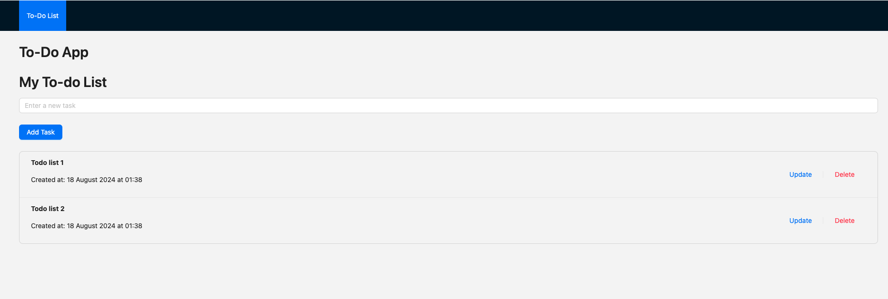
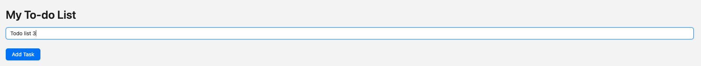
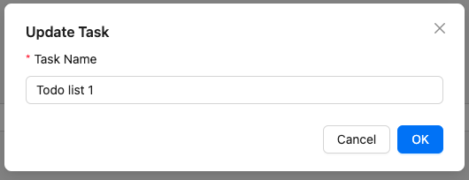

# Todo List Application

This project is a full-stack Todo List application built with a **Node.js** backend using **Express** and a **React** frontend with **TypeScript**. The backend uses **PostgreSQL** as the database and **Ant Design** is used for the frontend components.

## Features

- **Create**, **Read**, **Update**, and **Delete** (CRUD) operations for todo items.
- Backend: Node.js + Express + PostgreSQL.
- Frontend: React + TypeScript + Ant Design.
- Form validation using **Zod** on both backend and frontend.
- Unit tests and integration tests using **Jest** and **React Testing Library**.
- Development environment setup using **DevContainer** (VS Code).

## Prerequisites

Before running the application, ensure you have the following installed on your system:

- **Node.js**: version 20
- **Yarn**: package manager
- **Docker**: for running the whole project and the DevContainer
- **VS Code**: for running the development container

## DevContainer Setup

The project includes a **DevContainer** configuration for setting up a consistent development environment across different machines using Docker. The DevContainer ensures that all necessary dependencies are installed and available, and that the development environment runs consistently on **Windows**, **macOS**, or **Linux**.

### Setting Up the DevContainer

Guilde from VScode: https://code.visualstudio.com/docs/devcontainers/containers#_getting-started

1. **Install the Remote - Containers Extension in VS Code**:
   You can install the **Dev Containers** extension by searching for it in the VS Code Extensions Marketplace or [click here](https://marketplace.visualstudio.com/items?itemName=ms-vscode-remote.remote-containers).

2. **Open the Project in the DevContainer**:
   - Open VS Code and navigate to your project folder.
   - Press `Ctrl+Shift+P` (or `Cmd+Shift+P` on macOS) to open the Command Palette.
   - Type `Dev Containers: Rebuild Without Cache and Reopen in Container` and select it.

3. **DevContainer Setup**:
   The DevContainer configuration is located in the `.devcontainer/` directory. It automatically installs Node.js, Yarn, PostgreSQL, and other necessary dependencies when the container is started.

   ```plaintext
   .devcontainer/
   └── devcontainer.json
   ```

   Once the container is started, it will have all the necessary development tools installed. You can now run the application or tests directly inside the container.


## Running the Application in the DevContainer

Once you have the container up and running:

1. **Install dependencies**:
   Inside the DevContainer terminal, navigate to the backend and frontend directories and run the following command:

   ```bash
   yarn install
   ```

2. **Run the app**:
   To start both backend and frontend services, run:

   ```bash
   docker-compose up --build
   ```

   This will launch both the backend server and the frontend application.

3. **Access the app**:

   - The backend will be available at http://localhost:4000/api.
   - The frontend will be accessible at http://localhost:3000.

## Running Tests

You can run both frontend and backend tests within the container:

#### Backend Tests

To run the backend unit and integration tests:

   ```bash
   cd backend
   yarn test
   ```

#### Frontend Tests

Navigate to the frontend directory and run:

   ```bash
   cd backend
   yarn test
   ```

### Screenshots

Below are screenshots of the main user interface.

- **Todo List Page**: This is the main page where you can view the list of todos. You can add, update, or delete tasks from here.



- **Add New Task**: This shows the form for adding a new task to the todo list.



- **Update Task**: A modal that appears when you click the "Update" button to change the task name.

